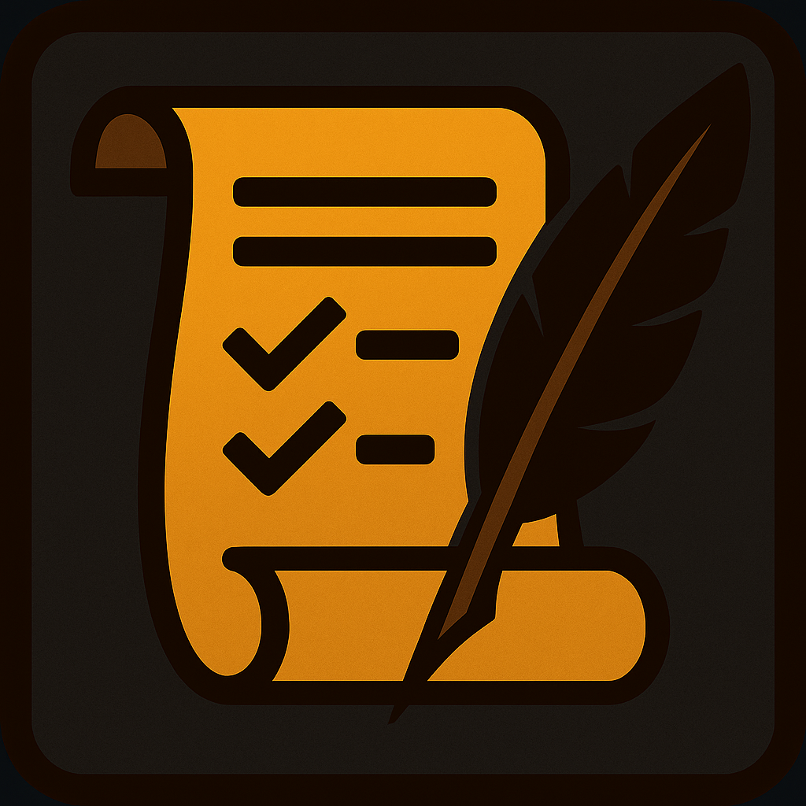

**Loot Wishlist** is a lightweight wishlist tracker for World of Warcraft that lets you add items straight from the Adventure Guide, plan your runs at a glance, and get smart alerts when your targets drop.

---

### ✨ Features

- 📘 Add from the Adventure Guide: A “Wishlist” button appears on each loot row — click to track.
- 🗂️ Smart list (Ace3): Groups by instance and, for raids, by boss in Encounter Journal order. Item links are hoverable. Per‑character storage.
- 📝 Sticky summary: A compact, draggable “sticky note” shows dungeons/raid bosses that still have wishlist items. Click to open the full list. Position is remembered.
- 🔔 Drop alerts with actions:
	- If you loot it: Remove or Keep the item on your list.
	- If someone else loots it: Whisper, Party announce, or Dismiss.
	- Alerts only trigger for items currently on your wishlist and show a clickable item link. Positions are remembered.
- 🎲 Optional raid roll alert: When a group loot roll begins in a raid for a wishlist item, a small popup reminds you to roll (toggleable).
- ✉️ Custom messages: Configure Whisper and Party templates with placeholders: `%item%`, `%looter%`.
- ⌨️ Slash commands: `/wishlist`, `/lwl`.

Ace3 is recommended for the full UI window. The Encounter Journal button and tracking work without it, but the list window uses AceGUI.

---

### 📋 How to Use

1. Open the Adventure Guide (Shift‑J) and browse to a boss.
2. In the loot list, click the “Wishlist” button on any row to add the item.
3. View your list:
	 - Type `/wishlist show`, or
	 - Click the sticky summary to open the full window.
4. Remove items:
	 - Click the remove icon next to the item in the list, or
	 - When you loot it, choose “Remove” in the alert, or
	 - Use `/wishlist remove <itemID>`.
5. Customize messages or toggle raid roll alerts via `/wishlist options` (Interface → AddOns → Loot Wishlist).

---

### 🛎️ Alerts behavior

- Alerts show only when the dropped item is on your wishlist (by design).
- If you looted it: choose “Remove” (deletes from wishlist) or “Keep”.
- If someone else looted it: “Whisper” (auto‑sends a polite ask), “Party” (posts to your group), or “Dismiss”.
- Alerts use a clickable item link and auto‑size to content. Windows remember their positions.

---

### ⚙️ Settings & Templates

- Open via `/wishlist options` (or `/wishlist settings`) or Interface → AddOns → Loot Wishlist.
- Template placeholders:
	- `%item%` → clickable item link
	- `%looter%` → the player who looted (Whisper only)
- Toggle: “Enable raid roll alert” — on by default.

---

### 🛑 Known Issues & Future Ideas

- Item data sometimes loads asynchronously. Links and counts will refresh shortly after the game provides item info.
- Alerts only trigger for items you’re tracking.
- Raid drops are untested. 

---

With **Loot Wishlist**, you’ll always know what to chase — and you’ll get a timely nudge when it finally drops.
