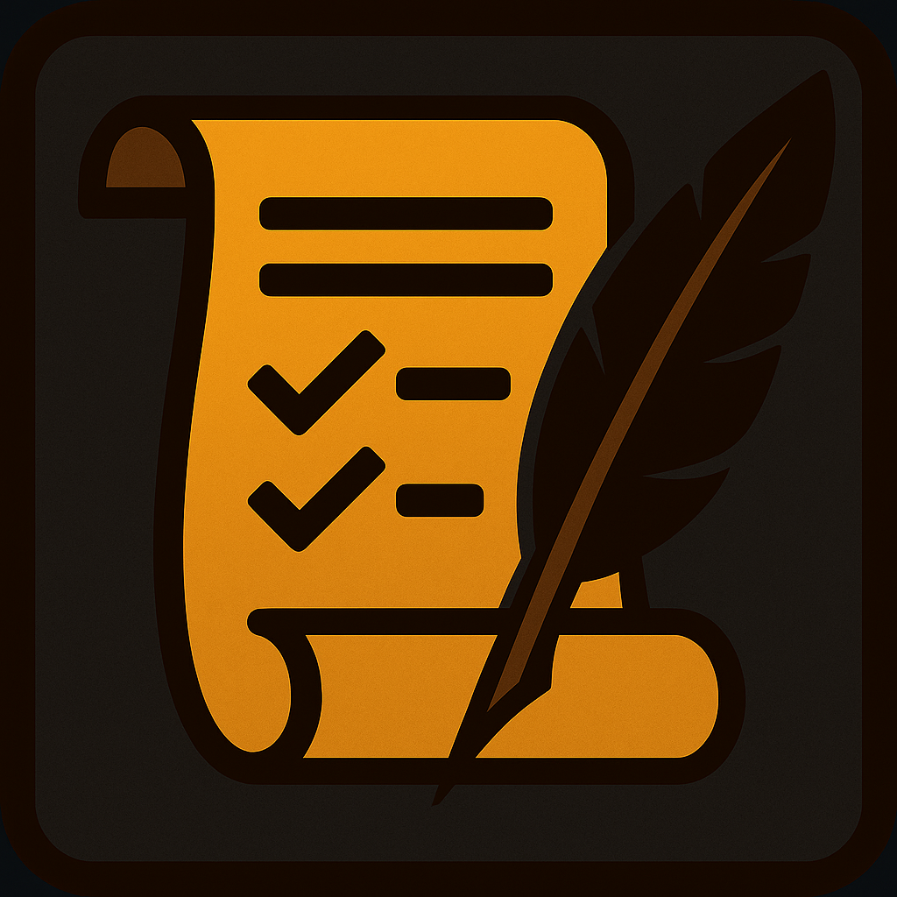

[Join the Discord](https://discord.gg/ptTtYyAjdZ)

# Lucky's Loot Wishlist

Track loot from the Adventure Guide and manage a per-character wishlist with spec-aware alerts.

## Features

- **Loot Browser** — browse the current season's dungeon and raid drop tables in one window, no Adventure Guide needed
  - See every dungeon's loot at once, or switch to all raids or the entire season
  - Filtered to your class with patterns and cosmetic drops left out, and narrowable to a single spec
  - Peek at any other class's loot table, view only, so you can scout for an alt or a friend
  - Pick a gear track (Veteran, Champion, Hero, Myth) and items are tracked at the matching difficulty
  - Group the list by source or by gear slot from the dropdown beside the track buttons
  - Filter by slot to see every trinket, weapon, or pair of hands in the pool
  - Search by item name, boss, slot, or armor type
  - Add or remove wishlist items with one click
- **Adventure Guide integration** — a "Wishlist" button appears on each loot row in the Encounter Journal; click to track any item across all tiers and difficulties
- **Manual add** — track any item by ID or item link with `/wishlist add`, handy for items outside the Adventure Guide
- **Spec-aware tracking** — records which specs can loot each item and shows them inline; items usable by all specs are tagged accordingly
- **Drop alerts** — notifies you when a tracked item drops, with context-sensitive actions:
  - *Self-looted:* Remove from wishlist or Keep tracking
  - *Looted by others:* Whisper the looter, announce to Party, or Dismiss
  - *Raid rolls:* reminder popup when a group loot roll starts for a wishlisted item
  - A sound plays with each alert, one for your own drop and another when it drops for someone else
  - Actions appear only when the drop reaches the gear track you track the item at; a copy on a lower track is highlighted and says so
  - Warbound items ("Warbound until equipped") are automatically filtered out of alerts
- **Spec reminders** — on entering a dungeon or targeting a raid boss, shows a summary of what to switch to:
  - Switch to a different spec for specific items
  - Stay in your current spec for others
  - Items usable in any spec
  - Items your class can't use (highlighted in red)
  - Reminders show once per instance or boss and reset when you leave
- **Group assist suggestions** — in dungeons, suggests party members who could switch loot spec to help funnel a tracked item, with one-click Whisper or Party prompts
- **Gear track labels** — each wishlist row names the track it is tracked at, so a Hero entry and a Myth entry read apart at a glance
- **Multi-difficulty tracking** — adding an item on Normal automatically tracks it on Heroic and Mythic too; items tracked across difficulties appear as a single row with combined tags (e.g. `[N·H·M]`) so the list stays clean
- **Great Vault highlights** — a gold star marks every vault reward slot that contains a wishlisted item; hover the star or the reward itself to see which boss and dungeon it comes from, so you can pick the right chest at a glance
- **Sticky summary window** — a compact, draggable overview of dungeons and raid bosses with remaining wishlist items; click to open the full list; position is remembered between sessions
- **Custom message templates** — configure Whisper and Party messages with `%item%` and `%looter%` placeholders
- **Multiple difficulty support** — track items across Normal, Heroic, Mythic, and LFR
- **Bonus roll targets** — mark any wishlist item as a bonus roll chase with the "BR" button in the Encounter Journal or on a wishlist row; a popup reminds you to spend Nebulous Voidcore charges after a Mythic+ 10+ run or a Heroic/Mythic raid boss kill when a flagged item could drop

## Installation

Install from [CurseForge](https://www.curseforge.com/wow/addons/luckys-loot-wishlist) or extract the release zip into your `Interface/AddOns` folder.

### Dependencies

- **LuckyUtils** — shared UI library (bundled automatically in CurseForge releases)

## Usage

1. Open the **Loot Browser** with `/wishlist browse` (or the **Browse Loot** button on the wishlist window) and click **+** on anything you want
2. Or browse to a boss in the **Adventure Guide** (Shift+J) and click the **Wishlist** button on any loot row
3. Open your wishlist with `/wishlist show` or `/lwl show`
4. Alerts appear automatically when tracked items drop in your group
5. Customise templates and toggles via `/wishlist settings` or **ESC > Options > AddOns > Lucky's Loot Wishlist**

## Slash Commands

`/wishlist` and `/lwl` accept the same subcommands:

| Command | Action |
|---------|--------|
| `/wishlist show` | Open the wishlist window |
| `/wishlist hide` | Hide the wishlist window |
| `/wishlist browse` | Open the season loot browser |
| `/wishlist settings` | Open the settings panel (also accepts `options`) |
| `/wishlist add <itemID or link>` | Manually add an item by ID or item link |
| `/wishlist list` | Print the number of tracked items |
| `/wishlist remove <itemID>` | Remove a single item by ID |
| `/wishlist clear` | Remove all tracked items |
| `/wishlist reset-spec` | Reset spec reminder debounce so they trigger again |
| `/wishlist debug` | Toggle debug logging |

## Settings

Access via `/wishlist settings` or **ESC > Options > AddOns > Lucky's Loot Wishlist**.

- Toggle the minimap button, which can also sit on a panel addon such as Titan Panel instead
- Choose what a plain, Ctrl- and Shift-click on the minimap button opens: both windows, the wishlist, or the Loot Browser
- Toggle the sticky summary window
- Adjust summary window opacity when your mouse isn't hovering over it
- Toggle automatic multi-difficulty tracking (on by default)
- Toggle Great Vault highlights (on by default)
- Hide Lucky's Wardrobe item previews in the wishlist and Loot Browser (only shown when that addon is installed)
- Toggle raid roll reminder alerts
- Toggle the sound played when a tracked item drops
- Toggle bonus roll reminders and their sound
- Configure the delay before spec reminders show after a boss kill
- Enable debug mode for troubleshooting
- Customise Whisper and Party message templates (`%item%`, `%looter%`)

## Known Issues

- Item data sometimes loads asynchronously — spec tags and links may appear a moment after opening the list
- Group assist suggestions are based on class and spec; they assume teammates can set loot spec even if not currently in that spec

## A note on AI

My addons are made by one person who plays the game and wants them to work properly. I use AI tools to move faster, mostly on code, bug hunting, and docs, but every change is reviewed and tested in game before release. If a feature feels off or something breaks, that's mine to fix, and the Discord is the fastest way to reach me.

## Author

**Lucky Phil**
